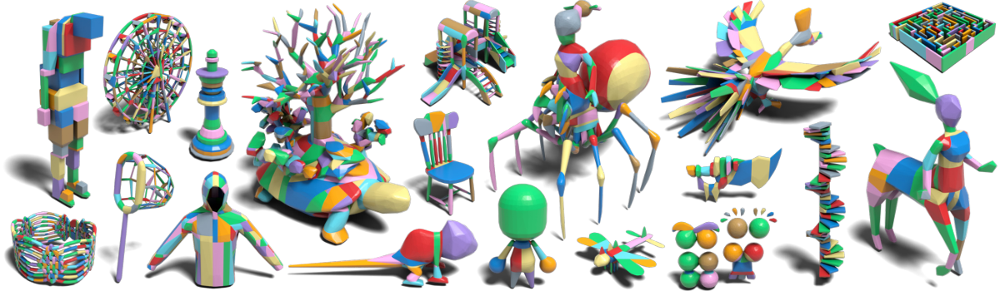

# CuACD: A Fully GPU-Resident Approximate Convex Decomposition [SIGGRAPH ASIA2026]

<p align="center">
  
</p>

**GPU-accelerated approximate convex decomposition for 3D meshes.**

[Paper](https://arxiv.org/abs/2609.28731)

`cuacd` is a fully **GPU-resident** approximate convex decomposition (ACD)
system. Every phase of the search-based ACD pipeline — convex hulls,
mesh–plane cutting, Hausdorff evaluation, tree search and
post-processing — is
a warp-level CUDA kernel backed by a device-side heap allocator, so phases
fuse into kernel sequences that never round-trip through the CPU. It shares
the lookahead-search formulation of [CoACD](https://github.com/sarahweiii/coacd)
(SIGGRAPH 2022) but runs the decomposition entirely on the GPU; the
[CuACD paper](#citation) reports more than an order of magnitude of speedup over
prior systems at matched or better quality.

The strip above shows every mesh in the gallery decomposed at τ=0.03; the
whole process took 17.7 s on one RTX 4090.

Convex decompositions are what physics engines, motion planners and grasping
pipelines actually want: collision queries against a handful of convex hulls
are exact and orders of magnitude faster than against a raw triangle soup.

## Installation

```bash
pip install cuacd
```

Requirements:

- An **NVIDIA GPU and driver** (`libcuda.so.1` / `nvcuda.dll`). No CUDA
  toolkit and no PyTorch are needed at runtime — kernels ship pre-compiled.
- **GPU architecture**: cubins for sm_70 / 72 / 75 / 80 / 86 / 87 / 89 / 90 /
  100 / 120 (Volta → Blackwell) plus embedded `compute_120` PTX, so newer
  GPUs run the kernels through driver-side JIT.
- Linux x86_64 (manylinux) or Windows x86_64; Python ≥ 3.10.
- Python deps: `numpy`, `trimesh`, `scipy`, `rtree`.

## Command line

```bash
cuacd tests/examples/Octocat-v2.obj out/       # → out/Octocat-v2.glb
cuacd meshes/ out/ -r --threshold 0.02          # whole directory, recursive
cuacd model.stl out/ --preprocess on --preprocess-resolution 128
```

Reads `.obj` / `.stl` / `.ply` / `.off` / `.glb` / `.gltf` and writes
**one GLB per input mesh**, with one node per convex part in a random
color. Meshes are processed in a pipelined loader → GPU → saver pipeline
across three processes; if a mesh triggers a native crash, the CLI reports
which mesh killed the run instead of hanging or exiting silently with a
half-written file.

| Option | Default | Meaning |
|---|---:|---|
| `--threshold` | `0.05` | Concavity tolerance per part, in units of the normalized mesh (largest extent = 2). Lower → more parts. |
| `--max-iters` | `100` | Maximum outer iterations. |
| `--width` / `--width2` | `30` / `5` | Candidate cuts per full / deeper expansion level. |
| `--depth` / `--quick-depth` | `2` / `0` | Full expansion levels, then cheap best-axis midpoint levels. |
| `--preprocess` | `auto` | Remesh to watertight manifold: `auto` only when the audit kernel flags the input, `on` always, `off` never. |
| `--preprocess-resolution` | `64` | Remesh grid resolution (power of two). |
| `--n-concave-edges` | `16` | Concave edges sampled per cutting part for candidate planes. |
| `--concave-threshold` | `3.49` | Dihedral angle (radians, ≈200°) below which an edge counts as concave. |
| `--parts` | off | Save the cut fragments instead of their convex hulls. |
| `--no-decompose-components` | off | Skip connected-component splitting (on by default in the CLI). |
| `--no-merge-hulls` | off | Disable the greedy hull-merge post-pass (on by default). |
| `--pool` | `0` (auto) | Device heap pool size, e.g. `512M`, `2G`; `0` = 70% of free VRAM. |
| `--device` | `-1` | GPU ordinal; `-1` reuses an existing CUDA context. |
| `--recursive`, `--serial`, `--bench` | off | Recurse subdirs; single-process debug mode; per-object timing + memory high-water mark. |

## Python API

```python
import numpy as np, trimesh, cuacd

mesh  = trimesh.load("tests/examples/Kettle.obj", force="mesh", process=False)
verts = np.ascontiguousarray(mesh.vertices, dtype=np.float32)
tris  = np.ascontiguousarray(mesh.faces,      dtype=np.int32)

# lookahead_decompose works in normalized units, so scale the mesh so its
# largest extent is 2 (this is what the CLI does for you).
lo, hi      = verts.min(axis=0), verts.max(axis=0)
center      = (lo + hi) / 2
scale       = float((hi - lo).max()) / 2
norm_verts  = ((verts - center) / scale).astype(np.float32)

with cuacd.Context() as ctx:                       # pool = 70% of free VRAM
    parts = ctx.lookahead_decompose(norm_verts, tris, threshold=0.05)

# parts: list of (part_verts, part_tris, hull_verts, hull_tris)
scene = trimesh.Scene()
rng = np.random.default_rng(0)
for _, _, hv, ht in parts:
    m = trimesh.Trimesh(hv * scale + center, ht)   # back to world space
    m.visual = trimesh.visual.ColorVisuals(mesh=m)
    m.visual.vertex_colors[:, :3] = (rng.random(3) * 255).astype(np.uint8)
    scene.add_geometry(m)
scene.export("kettle_hulls.glb")
```

All geometry moves through plain numpy arrays — no framework tensors.

| `Context` method | Returns | Notes |
|---|---|---|
| `lookahead_decompose(verts, tris, ...)` | `[(part_v, part_t, hull_v, hull_t)]` | The main entry point. Input must be normalized (extent ≈ 2). |
| `preprocess(verts, tris, resolution=64)` | `(verts, tris)` | PaMO stage-1 remesh ([Oh et al. 2025](#citation)); resolution must be a power of two ≥ 8. |
| `check_mesh(verts, tris)` | dict | Watertight / manifold / oriented verdict + raw bitmask. |
| `batch_hull_volume(pts_list)` | `(volumes, errors)` | D&C hull + divergence-theorem volume, per point cloud. |
| `batch_mesh_volume(verts_list, tris_list)` | `volumes` | Watertight mesh volumes. |
| `batch_hull_dandc_mesh(pts_list)` | `[(v, t, vol)]` | Exact hull meshes. |
| `batch_kdop_hull_mesh(pts_list)` | `[(v, t, vol)]` | Exact hulls via k-DOP prefilter — faster for large inputs. |
| `pool_usage()` / `heap_stats()` | bytes / tuple | Device-memory high-water mark and leak diagnostics. |
| `heap_compact()` | — | Coalesce freed heap blocks. |

Key `lookahead_decompose` knobs: `width` / `width2` (candidate cuts per level,
60 / 5 by default in the API), `depth`, `quick_depth`, `max_iters`,
`max_n_cutting` (parts processed in parallel per iteration), `threshold`,
`decompose_components`, `n_concave_edges`, `concave_eps` / `concave_threshold`
/ `concave_iters`, and `merge_hulls` (greedy merge pass, default **off** in the
API, **on** in the CLI).

## Performance

Mean per-mesh results from the [CuACD paper](#citation), measured on an
RTX 4090 / i9-12900K at threshold τ = 0.05, with every baseline's own
threshold swept until its output concavity matches CuACD's (cell format:
*concavity / parts / time*; lower is better on all three):

| Method | V-HACD (61 meshes) | PartNet-Mobility (14,085) | Objaverse subset (1,000) |
|---|---|---|---|
| CoACD (CPU)   | 0.0495 / 40.5 / 18.03 s | 0.0465 / 21.1 / 12.82 s | 0.0540 / 59.0 / 25.93 s |
| NavACD        | 0.0529 / 79.1 / 12.13 s | 0.0614 / 25.6 / 2.96 s  | 0.0950 / 79.5 / 40.25 s |
| VisACD        | 0.0604 / 37.5 / 9.60 s  | 0.0511 / 22.8 / 7.42 s  | 0.0702 / 59.9 / 15.92 s |
| **cuacd**     | **0.0488 / 33.6 / 0.23 s** | **0.0458 / 21.0 / 0.16 s** | **0.0496 / 48.9 / 0.25 s** |

That is **78× / 80× / 104× faster than CoACD** on the three benchmarks at
matched-or-better concavity, and 40–64× faster than VisACD, the fastest
prior GPU-assisted baseline. A control experiment isolates the source of the
gain: porting cuacd's concave-edge candidate pool back into CPU CoACD
reproduces the quality (33.7 parts, 0.048 concavity, 20.85 s/mesh) while cuacd
does it in 0.23 s — the speedup is the GPU system, not just the search
heuristics. On a laptop RTX 3080 Mobile it still averages 0.64 s/mesh on
V-HACD, an order of magnitude faster than any CPU baseline. cuacd completed
**every** input across all benchmarks and ablations with zero failures,
including the full Objaverse and meshes with degenerate triangles.

For a single mesh end-to-end, expect roughly one second of one-time cost
(process-level context creation plus kernel JIT, paid once per process) plus the
table above per mesh; e.g. the 40k-triangle `Octocat-v2` example
decomposes in ~1 s on an RTX 4090.

Decomposition is **not bit-reproducible** between runs — parallel search and
atomic ordering introduce ~1e-4-scale jitter in volume/Hausdorff and the
part count can shift by one or two. Compare aggregate statistics (part count,
total volume, vertex-count distribution), not exact geometry, in regressions.

## Building from source

Needs a C compiler plus either the CUDA toolkit (`nvcc`) or a prebuilt fatbin:

```bash
pip install .                                    # full build, all archs in CUACD_GPU_ARCHS
CUACD_GPU_ARCHS="89" pip install .               # fast dev build for one arch
CUACD_FATBIN=path/to/kernels.fatbin pip install . # host-only build, reuse a fatbin
```

The kernel blob is pure GPU code (PTX + cubins), so it can be built anywhere
nvcc exists and reused everywhere — the Windows wheels are built this way,
without nvcc on Windows at all. Useful build knobs:
`CUACD_GPU_ARCHS` (arch list), `CUACD_PARALLEL` (concurrent nvcc jobs),
`CUACD_DEBUG` / `CUACD_BEAM_DEBUG` / `CUACD_MEMCHECK` / `CUACD_LEAK_PROBE`
(debug builds), `CUACD_TRACK_EDGES`, `CUACD_GPU_ARENAS` (heap arena count).

## Repository layout

```
cuda/      device code (compiled into one fatbin, shipped as cuacd/kernels.fatbin)
csrc/      host C layer: driver-API launches, heap/pool, CPython module
cuacd/     Python package (Context API + CLI)
tests/     pytest suite + benchmarks
bench/     standalone CUDA micro-benchmarks (not built by setup.py)
docs/      algorithm notes, API notes, status
```

## Documentation

| Doc | Content |
|---|---|
| [`docs/algorithms.md`](docs/algorithms.md) | Algorithm overviews + memory architecture |
| [`docs/api_hull_dandc.md`](docs/api_hull_dandc.md) · [`api_kdop_hull.md`](docs/api_kdop_hull.md) · [`docs/api_plane_cut.md`](docs/api_plane_cut.md) | Per-kernel algorithm notes |
| [`docs/api_heap_allocator.md`](docs/api_heap_allocator.md) · [`arena_sweep.md`](docs/arena_sweep.md) | Device heap allocator design + benchmarks |
| [`docs/status.md`](docs/status.md) | What works, what is missing (e.g. ternary-search cut refinement) |
| [`docs/debugging.md`](docs/debugging.md) · [`implementation_notes.md`](docs/implementation_notes.md) | Debug flags, resolved gotchas |

Tests need a CUDA GPU: `python -m pytest tests/ -v`.

## Citation

If cuacd is useful, please cite the system paper (APA):

> Shi, R., Wei, X., Xiang, F., Xu, Z., & Su, H. (2026). CuACD: A fully
> GPU-resident approximate convex decomposition. In *SIGGRAPH Asia 2026
> Conference Papers (SA Conference Papers '26)*. ACM.
> https://doi.org/10.1145/3829340.3842217

along with the work it builds on:

> Wei, X., Liu, M., Ling, Z., & Su, H. (2022). Approximate convex decomposition
> for 3D meshes with collision-aware concavity and tree search. *ACM
> Transactions on Graphics (TOG), 41*(4), 1–18.

The watertight remeshing used by `preprocess` is a port of PaMO stage 1:

> Oh, S., Yuan, X., Wei, X., Shi, R., Xiang, F., Liu, M., & Su, H. (2025,
> October). PaMO: Parallel mesh optimization for intersection-free low-poly
> modeling on the GPU. In *Computer Graphics Forum* (Vol. 44, No. 7, p.
> e70267).

## License

LGPL-2.1-or-later, inherited from CoACD. See [`LICENSE`](LICENSE).
